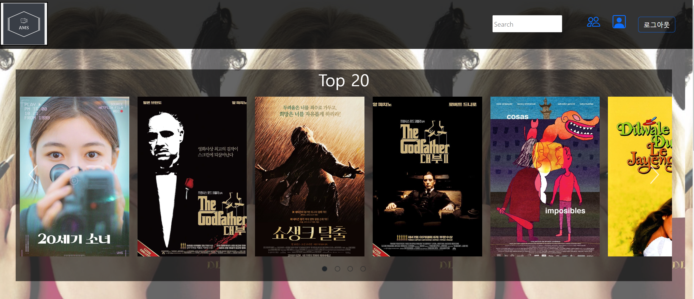
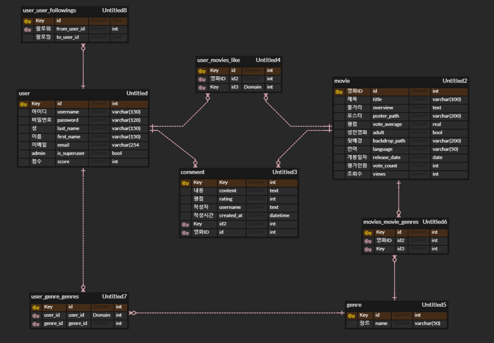

## 0. 개발 환경

- Django 3.2.13

- vue@ 2.7.14

 

## 1. 팀원 정보 및 업무 분담 내역

- 팀장 유정안 - 전반적으로 같이 진행(모델링, css, 페이지 생성 등), 영화 추천 알고리즘 코딩을 많이 담당함.

- 팀원 조현철 - 전반적으로 같이 진행(모델링, css, 페이지 생성 등), quiz 생성과 vue에서의 기능 구현을 많이 담당함.

 

## 2. 목표 서비스 구현 및 실제 구현 정도

 초기에 추상적으로 사용자 선호 장르 기반의 추천 알고리즘과 다른 유저들을 통해 추천하는 알고리즘을 생성하고자 하였습니다. 구체적인 서비스까지 기획하지는 못했고, 기능들을 만들어가 나가면서 추천 시스템도 추가하는 방식을 채택했습니다. 또한, 시간적으로 여유가 생긴다면 리뷰 작성을 통해 reward point를 주는 방식으로 파워 리뷰인을 만들고 랭킹을 산정하는 방식을 생각했습니다.

 

### 실제 구현 정도

TMDB api 를 통해 /movie/popular 에서 data 약 1만개를 json 파일로 저장했습니다.

실제 구현에 있어서 추천 기능은 다음과 같습니다.

1. 관람객수 가장 높은 영화 Top 20

2. 유저가 선호하는 장르 랜덤 추천

3. 전체 유저들이 가장 좋아하는 영화 추천(좋아요 기준)

4. 유저가 팔로우한 유저들이 좋아하는 영화 추천 (좋아요 기준)

5. 같은 등급의 유저들이 좋아하는 영화 추천(좋아요, 조회수 기준)
   
   그 외 기능: 회원가입, 팔로우, 좋아요, 검색 기능, 선호 장르 선택, 퀴즈, 리뷰 작성 기능

실제 구현에서는 point reward를 주는 방식 대신에 회원가입시 퀴즈를 통해 등급을 산정하는 방식으로 구현했습니다. 팔로우, 좋아요, 조회수 기능을 추가하여 다양한 방법으로 추천하는 서비스를 만들었습니다.

## 3. 데이터베이스 모델링 (ERD)

 

## 4. 영화 추천 알고리즘에 대한 기술적 설명

1. 관람객수 가장 높은 영화 Top 20

    관람객수가 가장 많은 영화를 정렬하여 보여줍니다.

2. 유저가 선호하는 장르 랜덤 추천

    회원 가입시 유저가 선호하는 장르 3가지를 선택하여 저장합니다. 메인 페이지로 이동시 각 genre_id와 함께 서버에 요청하여 해당 장르 영화를 랜덤으로 추천을 해줍니다.

3. 전체 유저들이 가장 좋아하는 영화 추천(좋아요 기준)

    user 와 movie 모델은 like_movies 로 M:N 연결되어 있습니다. 메인 페이지로 이동시 전체 영화 목록에서 각각의 영화를 좋아요 누른 user의 수를 세서 가장 많은 영화 10개를 정렬해서 추천을 해줍니다. 

4. 유저가 팔로우한 유저들이 좋아하는 영화 추천 (좋아요 기준)

    유저가 팔로우하는 유저 목록을 만들고, 그 유저들이 좋아하는 movie id 를 key로 value 1인 딕셔너리를 생성합니다. movie id가 기존 딕셔너리에 존재하면 +1을 하는 방식으로 만듭니다. 딕셔너리의 key 값을 통해 movies_id 리스트를 생성하여 해당 qurey 객체를 만들어 좋아요 높은 순서대로 front에 보내어 추천을 해줍니다. 

5. 같은 등급의 유저들이 좋아하는 영화 추천(좋아요, 조회수 기준)

    회원 가입시 10 문제를 통해 유저 등급이 정해집니다. 정해진 등급과 같은 등급을 가진 다른 유저가 좋아요한 영화들을 목록으로 생성합니다. 좋아요 1개당 20점 조회수 1회당 1점을 point로 하여 가장 많은 포인트를 가진 영화 10개를 추천해줍니다. 

 

## 5. 서비스 대표 기능에 대한 설명

저희 팀에 대표적인 기능은 회원 가입시 영화 선호 장르를 선택해야 되고, 영화 Quiz 10문제를 통해 회원 등급이 정해지는 것이 특징입니다.

그 등급을 토대로 같은 등급의 유저들의 '좋아요'와 '조회수' point를 통해 영화를 추천해주는 기능입니다.
두번째로는 팔로우 기능을 통해 유저가 팔로우하는 다른 유저들의 좋아요 목록을 볼 수 있고, 유저가 팔로우하는 모든 유저들이 가장 좋아하는 영화를 추천해주는 기능입니다.

 

## 6. 배포 서버 URL

http://ams-pjt.site

 

## 7. 기타/ 느낀 점 후기 등

구성부터 모델링, 배포까지 아우르는 프로젝트를 처음 진행하다보니 부족한 점들이 많았습니다. 기능적으로도 추가/개선할 부분이 많이 있지만 정해진 시간이 있기에 모두 구현하는 것에 어려움이 있었습니다. 프로젝트를 진행하면서 많은 어려움이 있었고 부족한 부분들이 팀원으로 인해 배울 수 있어 한편으로는 뜻 깊은 시간이었습니다. 서로 다른 관점에서 문제를 바라보면서 문제해결력을 기를 수 있었습니다. 마지막으로 막상 프로젝트를 끝내고 나면서 무엇이 부족한 지 눈에 보여 다음 프로젝트에서는 분명 더 나아진 결과물을 만들어 낼 수 있겠다는 생각을 하게 되었습니다.
